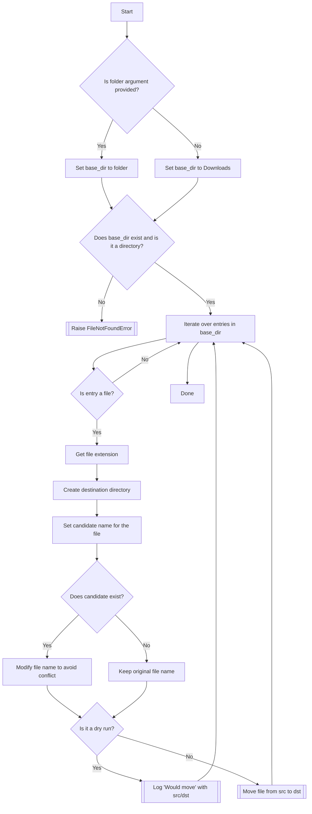

```mermaid
flowchart TD
    A[Start] --> B{Is folder argument provided?}
    B -- Yes --> B1[Set base_dir to folder]
    B -- No --> B2[Set base_dir to Downloads]
    B1 --> C{Does base_dir exist and is it a directory?}
    B2 --> C
    C -- No --> X[[Raise FileNotFoundError]]
    C -- Yes --> D[Iterate over entries in base_dir]
    D --> E{Is entry a file?}
    E -- No --> D
    E -- Yes --> F[Get file extension]
    F --> G[Create destination directory]
    G --> H[Set candidate name for the file]
    H --> I{Does candidate exist?}
    I -- Yes --> J[Modify file name to avoid conflict]
    I -- No --> K[Keep original file name]
    J --> L{Is it a dry run?}
    K --> L
    L -- Yes --> M[[Log 'Would move' with src/dst]]
    L -- No --> N[[Move file from src to dst]]
    M --> D
    N --> D
    D --> Z[Done]


```